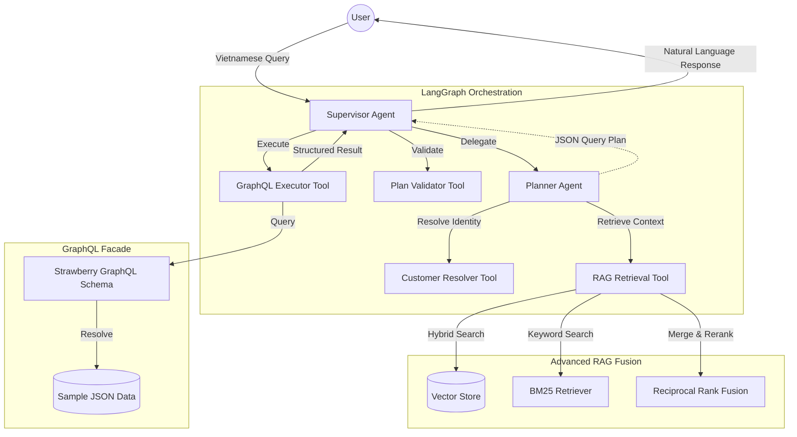
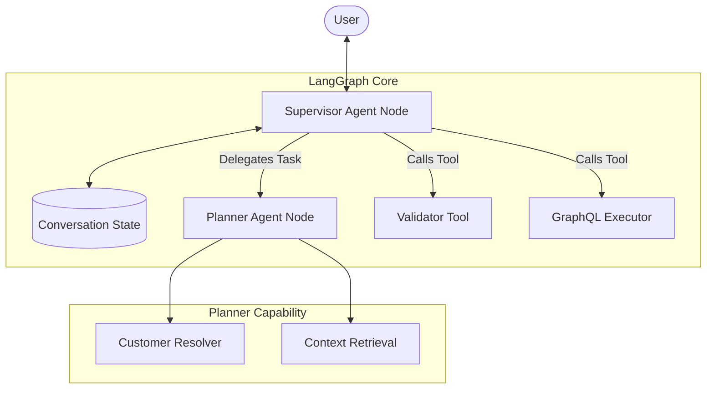
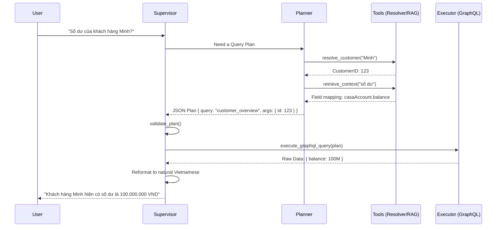
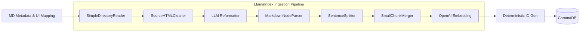
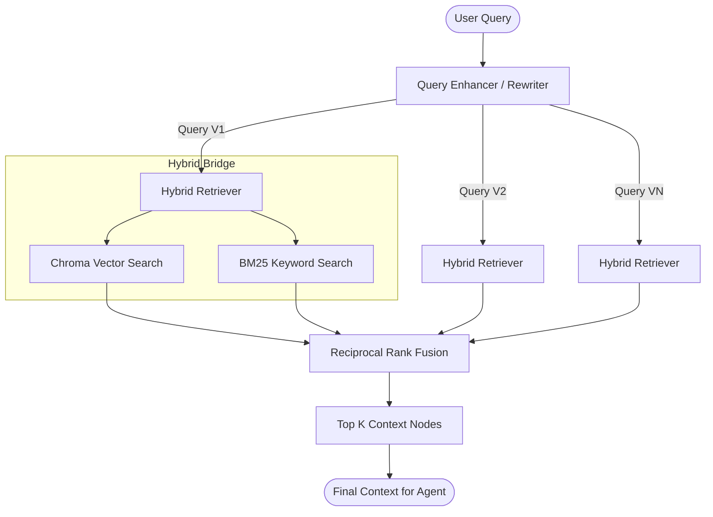

# Text-to-GraphQL Architecture

This document describes the technical architecture of the Text-to-GraphQL PoC, which enables querying banking customer data using natural Vietnamese language.

## 🏗 System Overview

The system follows a **Supervisor Agent** pattern implemented with **LangGraph**. It bridges the gap between unstructured Vietnamese queries and a structured GraphQL API by using a specialized Planner agent and a robust Context Retrieval (RAG) system.

### High-Level Component Diagram

---

## 🤖 Agent Architecture (`src/agents/`)

The agent layer is built on **LangGraph Supervisor**, which provides a stateful, multi-agent workflow.

### Architecture Diagram

### Execution Sequence Diagram

---

## 🔍 Data Ingestion Pipeline (`src/context/`)

Knowledge and metadata are ingested into a Vector Store to enable the agent to "understand" the data lake schema and Vietnamese business terms.

### Ingestion Flow Diagram

### Retrieval Flow (RAG Fusion)

The retrieval process uses a multi-stage **RAG Fusion** approach to ensure high accuracy when mapping Vietnamese business terms to technical GraphQL fields.

#### Detailed Retrieval Logic:

- **Query Enhancement**: Generates multiple variations of the user's Vietnamese query to capture different semantic angles.
- **Hybrid Retrieval**: Executes both semantic (Dense) and keyword (Sparse) searches for every query variation.
- **Reciprocal Rank Fusion (RRF)**: Merges all search results into a single list, ensuring that tokens found across multiple versions or retrievers are boosted to the top.

### Key Components:

- **LLM Reformatter**: Uses GPT-4o-mini to clean and re-index raw metadata into a more "retrievable" format for the agent.
- **Deterministic IDs**: Uses SHA-256 hashes of content to ensure that re-running the pipeline updates existing documents instead of creating duplicates.
- **Advanced Retrieval**:
  - **Hybrid Fusion**: Combines Vector Search (Dense) + BM25 (Sparse).
  - **RRF (Reciprocal Rank Fusion)**: Reranks the merged results to ensure the most relevant schema mappings appear first.

---

## 🧩 Other Core Components

### 1. GraphQL Facade (`src/graphql_facade/`)

- **Schema (`schema.py`)**: Defines domain types (Customer, Account, AUM, NBO).
- **Resolvers (`resolvers.py`)**: Connects GraphQL queries to physical JSON data files.

### 2. Implementation Tools (`src/tools/`)

- **Customer Resolver**: Identity resolution tool.
- **Context Retrieval**: RAG-powered schema mapping tool.
- **Validator**: Logic to prevent halluncinated or unsafe queries.
- **Executor**: Bridge between the Agent's plan and the GraphQL endpoint.

---

## 🛠 Tech Stack

- **Orchestration**: LangGraph (Supervisor Pattern)
- **RAG Framework**: LlamaIndex
- **Embedding**: OpenAI `text-embedding-3-small`
- **Vector DB**: ChromaDB
- **GraphQL**: Strawberry (Python-native)
- **API**: FastAPI
