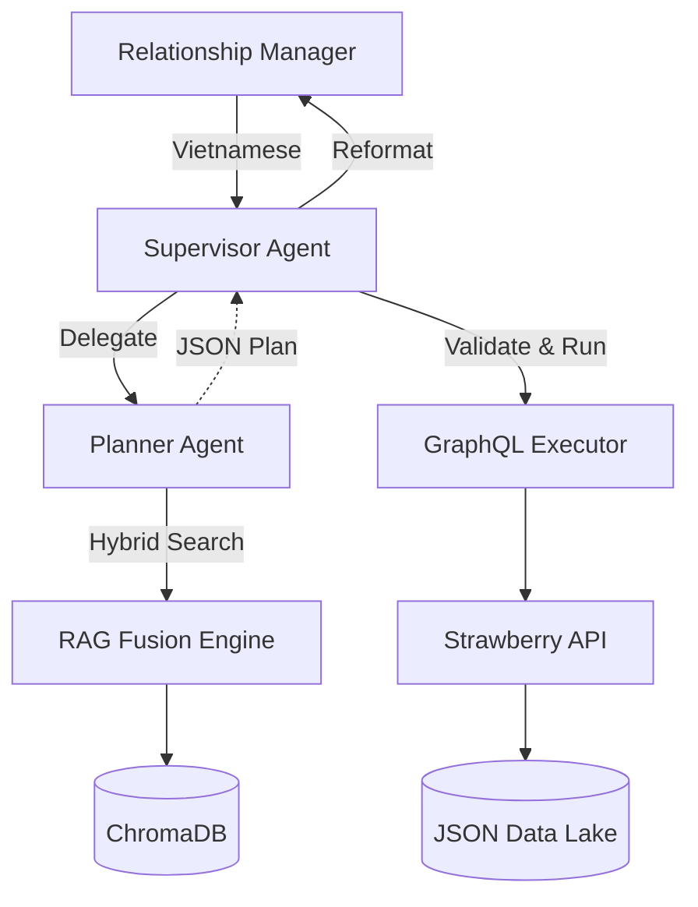

# Text-to-GraphQL AI Assistant (PoC)

A Proof of Concept for an AI Assistant that allows Relationship Managers (RM) at Techcombank to query customer data using Vietnamese natural language.

The system translates **Vietnamese intent → Agentic Planning → Advanced RAG → GraphQL → Mock Data Lake → Natural Vietnamese Response**.

## 🌟 Key Features

- **Natural Language Understanding**: Complex Vietnamese queries about customers, balances, AUM, and NBOs.
- **Agent Orchestration**: Powered by **LangGraph Supervisor** to coordinate a specialized **Planner** node and multiple retrieval/execution tools.
- **Advanced RAG Fusion**: Implements Hybrid Search (Dense + Sparse) and Reciprocal Rank Fusion (RRF) to map business terms to GraphQL schema fields accurately.
- **LLM Metadata Enrichment**: Automatic reformatting of data lake documentation during ingestion for better retrieval performance.
- **GraphQL Facade**: A domain-specific API built with **Strawberry** that abstracts underlying data complexity.

## 🚀 Quick Start

### Prerequisites

- Python 3.11+
- OpenAI API Key
- LangSmith API Key (optional but recommended for tracing)

### Local Installation

1. Clone the repository
2. Install dependencies:
   ```bash
   pip install -e .
   ```
3. Set up environment:
   ```bash
   cp .env.example .env
   # Add your OPENAI_API_KEY and LANGCHAIN_API_KEY to .env
   ```
4. **Ingest Metadata**:
   ```bash
   # Re-ingests markdown files into ChromaDB with deterministic IDs
   python -m src.main --ingest
   ```
5. **Start the server**:
   ```bash
   python -m src.main
   ```
6. Open your browser at `http://localhost:4444` to access the Gradio Chat UI.
   - GraphQL Playground: `http://localhost:4444/graphql`
   - API Docs: `http://localhost:4444/docs`

## 📝 Example Queries

- "Cho tôi tổng quan khách hàng Nguyen van A"
- "Top 3 NBO và AUM 3 tháng của khách hàng Pham Quang Minh là gì?"
- "CASA hiện tại của khách hàng có mã Cus1 là bao nhiêu?"
- "Thông tin thu nhập và chi phí hàng tháng của khách hàng Minh?"

## 🏗 Architecture

The system uses a state-of-the-art **Supervisor-Planner** pattern with **RAG Fusion**.



See [ARCHITECTURE.md](ARCHITECTURE.md) for detailed technical diagrams and sequence flows.

## 📊 Project Structure

- `src/agents/`: LangGraph orchestrator and Planner definitions.
- `src/context/`: Advanced RAG fusion retrievers and LLM-powered ingestion pipeline.
- `src/graphql_facade/`: Strawberry schema and data-lake resolvers.
- `src/tools/`: Identity resolution, schema mapping, and query execution tools.
- `notebooks/`: E2E testing and Ingestion experimentation.

## 📜 Development

See [AGENTS.md](AGENTS.md) for coding conventions, LangGraph state management, and instructions on adding new capabilities.
